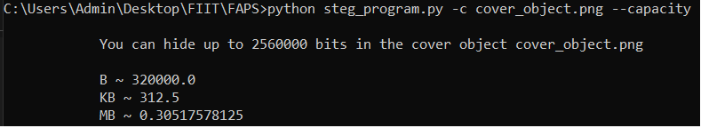

# Steganographic tool for the LSB method


I have decided to implement the LSB method in the programming language Python. The secret message will be  first transformed into a binary string and then these bits will be substituted for the least significant bits in each channel in the cover picture. The code is uploaded and continuously updated on public repository on GitHub [14].

## Focus of the tool
In the implementation, the focus is set purely on the process of LSB method and to show an example of how this method works.  Images used as the cover objects are from the spatial domain (PNG).  The application is a python script, that is supposed to be ran from the command line with defined arguments. The arguments that the script takes are shown in the figure 15. 


## Structure of the hidden file
Three key factors are important in hiding messages and data inside an image using the LSB method. We need the data that is to be hidden inside an image, then the number that tells us how many least significant bits should be read in the uncovering process and since the program operates on files as well, we need to store the extension of the file. 
The extension is vital, because after uncovering secret data from the steganographic object, the operating system needs to know how to interact with the uncovered file. The number of bits hidden i.e. the length of the hidden data, together with the extension is the header. After the header follows the payload i.e. the hidden data itself.


The object that is to be hidden is shown. The hidden data consists of a header and the actual payload. First four bits of the header are dedicated for the file extension or hidden message type. Four bits means that only 16 (2^4) file types can be hidden. Next is the actual size of the payload or bits that need to be retrieved from the image in the process of uncovering. We cannot read all the least significant bits of a steganographic object image, because the hidden message bitstring is not always as long as all the least significant bits in the cover object. In the optimal scenario, when we have a large image, we can hide up to 2^28 bits of data. That is 32 MB.

## Process of concealment
The process of hiding consists of two phases. In the first phase the cover object is loaded. To load the image the Pillow python package is used. The resolution of the image, number of channels and a 2D numpy array of pixels is stored. The maximum capacity attribute tells us how big of a file can be hidden in the image. After the cover object is loaded, we move to the next phase.

In the second phase, we split the filename and get the extension. Next, we load the object, that is to be hidden, as a sequence of bytes. If the length of the byte string multiplied by eight (number of bits) is greater than the capacity of the cover object or how much the data structure can handle, error is returned. If it is not greater, then the count is formatted to be represented by 28 bits. The payload is then transformed from a byte string to a binary string. The file extension together with the size of the payload and the payload is concatenated into one binary string. 

We then proceed to traverse through the binary string of the secret data together with the pixels of the cover object. If the remaining after dividing the value of the channel by two is corresponding to the bit in the binary string, nothing is changed. If not, the least significant bit is flipped to the other value. After the last bit of the secret data binary string is checked, we return with the message that the object was successfully hidden in the cover object. This newly created steganographic object will be then saved. 

## Uncovering the hidden message
To uncover the hidden message inside the steganographic object, we reverse the process of concealment. First, we need to extract the header that tells us about the total count of bits that are hidden and the file extension. We continue to traverse the matrice, that represents the image, and stop once the number of bits extracted is equal to the total count of bits that were hidden. The extracted data is then converted back to byte string and saved with the extension to a new file. If the file type tells us that the hidden data was a message, the message is outputted to the command line. 


## Capacity
```bash
python steg_program.py --cover cover_object.png --capacity
```



## Embedding a secret file
```bash
python steg_program.py --cover cover_object.png --file secret_messages/secret1.jpg
```
## Embedding a secret message
```bash
python steg_program.py --cover cover_object.png --message "Hello World"
```
## Uncovering the secret message
```bash
python steg_program.py --cover cover_object.png --decode
```